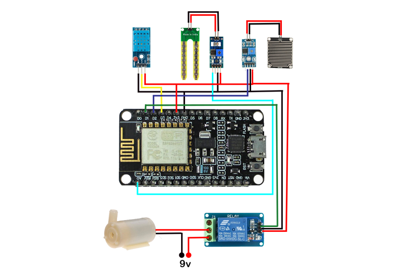

# Smart_Irrigation

This project is a smart irrigation system that uses the ESP8266 microcontroller to automate water management based on real-time sensor data. The system can monitor soil moisture, detect rain, and measure temperature and humidity to control a water pump efficiently.

## Features
- **Automated Irrigation**: Turns the water pump on or off based on soil moisture and weather conditions.
- **Web Interface**: Displays real-time sensor data and provides manual control options for the pump.
- **Real-Time Monitoring**: Measures and displays humidity, temperature, soil moisture, and rain status.

## Components Used
- **ESP8266 (NodeMCU)**: Microcontroller for processing and WiFi connectivity.
- **DHT22 Sensor**: Measures temperature and humidity.
- **Soil Moisture Sensor**: Detects the moisture level in the soil.
- **Rain Sensor**: Detects rain to avoid watering during rainfall.
- **Relay Module**: Controls the water pump.
- **Water Pump**: Provides irrigation when soil is dry.

## Circuit Diagram

## Code Explanation
The code uses the following logic to automate the irrigation system:
1. Connects to a WiFi network and hosts a web server.
2. Reads data from sensors (humidity, temperature, soil moisture, and rain status).
3. Displays data on a web interface with thermometers indicating sensor levels.
4. Allows manual control of the water pump via the web interface.
5. Uses thresholds to decide when to turn the pump on or off automatically.

### Key Functions
- **`getHumidityLevel(float humidity)`**: Determines the level of humidity (Low, Medium, High).
- **`getTemperatureLevel(float temperature)`**: Determines temperature conditions (Cold, Cool, Warm, Hot).
- **`getMoistureLevel(int moisture)`**: Provides moisture status (Dry, Moist, Wet).

### HTML & CSS for Web Interface
The web interface shows real-time sensor values and allows control of the water pump. Each sensor’s status is displayed as a thermometer with color-coded levels.

## How to Use the System
1. **Power the System**: Connect the ESP8266 to a power source (USB or battery).
2. **Access Web Interface**: Use the IP address printed in the Serial Monitor to access the system’s interface on a browser.
3. **Monitor and Control**: View real-time data and control the pump.

## Setting Up the Code
1. **WiFi Credentials**: Enter your WiFi SSID and password in the code.
2. **Upload Code**: Use Arduino IDE to upload the code to your ESP8266.
3. **Run the System**: Open Serial Monitor to view the IP address for accessing the web interface.

## Example Output
- **Humidity**: `69% (High)`
- **Temperature**: `27°C (Warm)`
- **Soil Moisture**: `543 (Moist)`
- **Rain Status**: `No Rain`

## License
This project is open-source and available under the MIT License.
